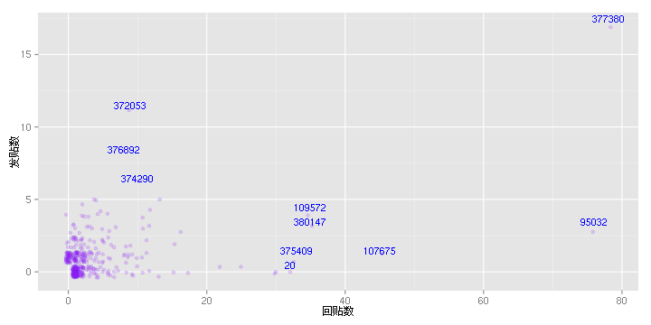

# Cos.Name 定期统计
--------------------------------

* 最近30天（2013-06-11至2013-05-11）论坛上共有416人参与讨论，共发表了1752篇文字（其中包括362篇主题和1390篇回复）。


* 其中发帖最多的20人的ID及发帖数是：


```
## 
## 377380  95032 107675 109572 380147 375409     20      1 380097 378520 
##     95     79     46     39     38     34     32     30     30     25 
## 379083 372053 375194 380257 102646    336 374290 376892 380287  13526 
##     22     20     19     18     17     17     16     16     16     15
```


* 他们所发表的帖子数目是624篇，占了总数的35%的比重。

* 每个人单回贴/发帖情况如下图，离群点标记其ID：




* 文件 [cosdata.txt] (https://github.com/JiangXD/cos_stat/blob/master/cosdata.txt) 含所有自论坛创建以来的数据。(这个是自己从页面抓的，不尽准确，分析请用cosdata-mysql.csv)

* 官方文件 [cosdata-mysql.csv](https://github.com/JiangXD/cos_stat/blob/master/cosdata-mysql.csv) 是直接从论坛数据库导出的文件，格式与 cosdata.txt 类似
，为保护隐私第一列换成了论坛UID。但是，你懂的。

* cosdata-mysql.csv中，第一列`poster_id`为用户ID，第二列`topic_id`是主题的ID，第三列`post_id`是帖子的ID，
第四列`is_topic_poster`表示是否是楼主（即是新帖或是回复），第五列`post_time`是帖子发表时间。
主题（topic）与帖子（post）的区别在于，主题是对一个新帖及其回复的总称，而帖子可能是新帖，也可能是回复，这可以通过`is_topic_poster`来判断。可以确定的是，`is_topic_poster`为`TRUE`当且仅当`topic_id == post_id`。

* 统计采用官方数据，并用knitr包驱动更新，感谢益辉。

